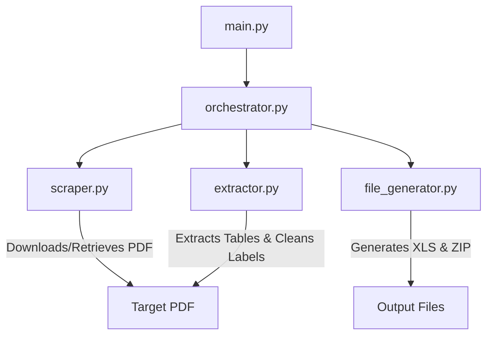

# USDAGOO Runbook Pipeline

An automated data pipeline for downloading, extracting, validating, and packaging USDA Agricultural Outlook Forum Grains and Oilseeds Outlook reports.

---

## 1. Project Overview

The **USDAGOO** pipeline automates the processing of annual commodity outlooks published by the USDA Office of the Chief Economist. Specifically, it targets the **Grains and Oilseeds Outlook** report, extracting detailed balance sheet projections for **Corn, Soybeans, Soybean Meal, Soybean Oil, and Wheat**.

* **100% Accuracy**: The pipeline matches reference historical datasets precisely.
* **Dual Execution Modes**:
  * **Online Mode**: Uses Selenium Stealth with headless Chrome to scrape the official USDA site, expand accordion menus, and download the target PDF.
  * **Offline Mode (Automatic Fallback)**: Bypasses web scraping if a matching PDF is present locally in `Project_Information/Samplepdfs/`, enabling sandbox-independent testing and runs.

---

## 2. Pipeline Architecture

The pipeline follows a modular architecture:



### Component Details
* **[main.py](file:///D:/Projects/SIMBA-RUNBOOKS/USDAGOO_RunBook/main.py)**: The entrypoint that initializes logging and triggers the orchestrator.
* **[orchestrator.py](file:///D:/Projects/SIMBA-RUNBOOKS/USDAGOO_RunBook/orchestrator.py)**: Manages the execution sequence and passes data between stages.
* **[scraper.py](file:///D:/Projects/SIMBA-RUNBOOKS/USDAGOO_RunBook/scraper.py)**: Handles web navigation/downloads or falls back to pre-downloaded local PDFs.
* **[extractor.py](file:///D:/Projects/SIMBA-RUNBOOKS/USDAGOO_RunBook/extractor.py)**: Reads tables from the PDF using PyMuPDF (`fitz` `find_tables()`). It processes both merged row styles (like Corn/Wheat) and sequential grid structures (like Soybeans).
* **[file_generator.py](file:///D:/Projects/SIMBA-RUNBOOKS/USDAGOO_RunBook/file_generator.py)**: Generates the standard data spreadsheet (`DATA.xls`), metadata spreadsheet (`META.xls`), and packages them into a timestamped `.zip` archive.

---

## 3. Configuration

All pipeline settings are defined in **[config.py](file:///D:/Projects/SIMBA-RUNBOOKS/USDAGOO_RunBook/config.py)**:

* `TARGET_YEAR`: Set to a specific year (e.g., `2024`, `2026`) or `None` to dynamically detect and target the latest available year.
* `HEADLESS`: Controls whether Chrome runs in headless mode (`True` by default).
* `ABSOLUTE_COLUMNS`: The ordered list of absolute mappings (Code & Description) used to guarantee identical output file structures.
* `TABLE_CONFIGS`: Extraction keywords and label-to-code maps for each commodity section.

---

## 4. How to Run

### Setup Environment
Ensure you have the required dependencies installed:
```bash
pip install pymupdf pandas openpyxl xlrd selenium selenium-stealth
```

### Running the Pipeline
Simply execute `main.py` from the root directory:
```bash
python main.py
```

### Outputs
Pipeline outputs are generated in:
* `output/<timestamp>/` (timestamped folders containing `DATA.xls`, `META.xls`, and the `.zip` package)
* `output/latest/` (the most recent runs for quick access)

---

## 5. Project Information & Testing

All raw documentation, manual reference data, and developer test scripts are located in **[Project_Information/](file:///D:/Projects/SIMBA-RUNBOOKS/USDAGOO_RunBook/Project_Information)**:

* **[CLAUDE.md](file:///D:/Projects/SIMBA-RUNBOOKS/USDAGOO_RunBook/Project_Information/CLAUDE.md)**: Developer context containing details on findings, technical successes, and pipeline logic.
* **[Samplepdfs/](file:///D:/Projects/SIMBA-RUNBOOKS/USDAGOO_RunBook/Project_Information/Samplepdfs)**: Cache of historical PDF documents for offline testing.
* **Validation Tools**: Scripts moved to `Project_Information/` to keep the root directory clean:
  * `compare_outputs.py`: General comparison script to audit generated results against reference files.
  * `verify_structural_identity.py`: Validates header codes and descriptions to ensure format conformance.
  * `test_extraction_all.py`: Core extraction tests.
